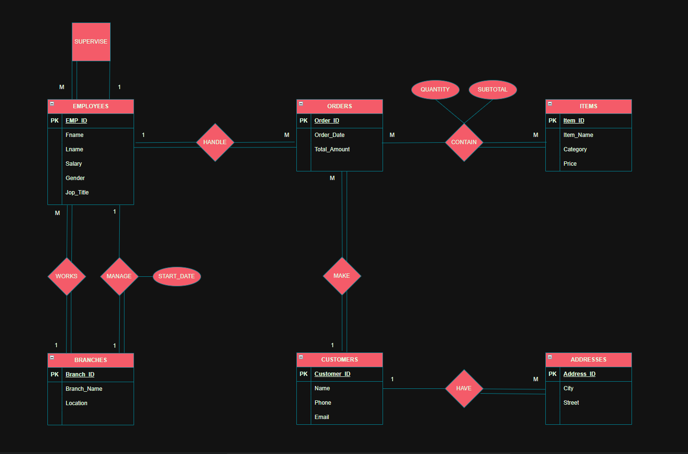
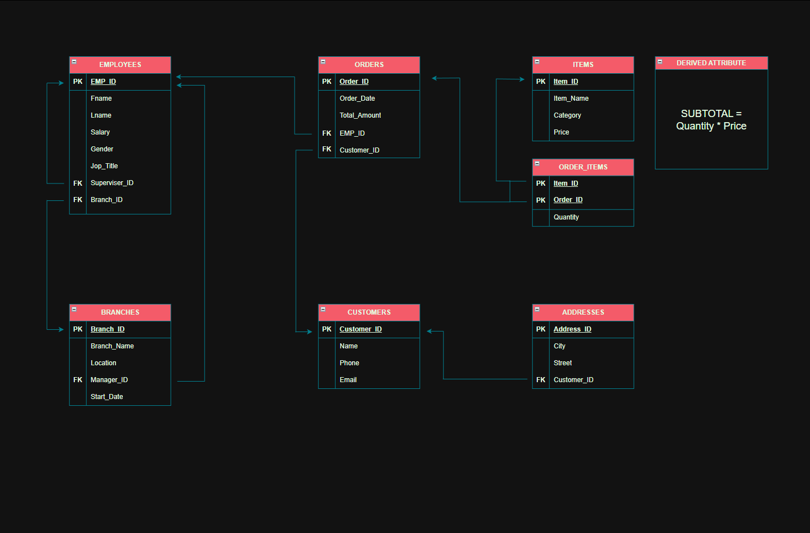
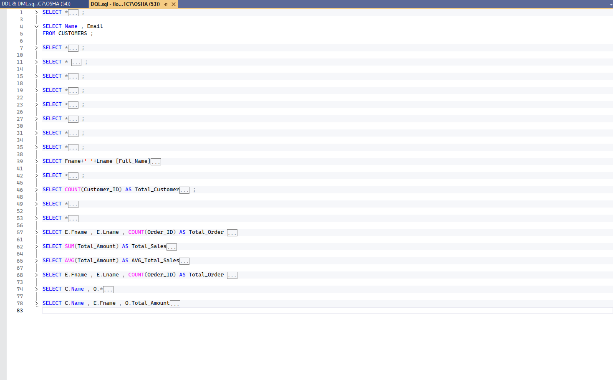

# ☕ Café Database System

## 📌 Project Overview

This project represents a complete database system designed for a Café.
It follows a structured approach starting from requirements analysis (SRS) to database implementation and querying.

The system manages:

* Customers
* Employees
* Orders
* Menu Items
* Branches
* Addresses

---

# 🚀 Project Workflow

This project follows a full database development lifecycle:

**SRS → ERD → Mapping → DDL & DML → DQL**

---

# 📄 1. System Requirements (SRS)

The system requirements were collected and documented to understand the business needs of the café system.

👉 [View SRS](Docs/SRS.pdf)

## 🔹 The SRS includes:

* Functional Requirements
* System Scope
* Entities and Relationships
* Business Rules

## 🎯 Outcome:

Defined all entities and relationships needed for the system.

---

# 🧠 2. ERD (Entity Relationship Diagram)

Based on the SRS, an ERD was created to visualize the system.

## 🔹 Entities:

* Employees
* Customers
* Orders
* Items
* Branches
* Addresses

## 🔹 Relationships:

* Works (Employee → Branch)
* Manage (Branch → Employee)
* Make (Customer → Orders)
* Handle (Employee → Orders)
* Contain (Orders ↔ Items) (M:M)
* Have (Customer → Address)
* Supervise (Employee → Employee)

---

## 📊 ERD Diagram



---

# 🧱 3. Mapping (ERD → Tables)

The ERD was transformed into relational tables.

## 🔹 Key Design Decisions:

* M:M relationship (Orders & Items) → `Order_Items`
* Recursive relationship → `Supervisor_ID`
* Relationships implemented using Foreign Keys

## 📊 Mapping Diagram



---

# 💻 4. DDL (Database Definition Language)

The database schema was created using SQL.

## 🔹 Includes:

* CREATE DATABASE
* CREATE TABLE
* PRIMARY KEY & FOREIGN KEY
* ALTER TABLE (handling circular dependency)

👉 Check the SQL file:

```text
SQL/DDL_DML.sql
```

---

# 🧾 5. DML (Data Manipulation Language)

Sample data was inserted into all tables.

## 🔹 Includes:

* Branches
* Employees (including managers)
* Customers
* Items
* Orders
* Order_Items
* Addresses

---

# 🔍 6. DQL (Data Query Language)

Queries were written to analyze the data and extract insights.

👉 Check queries here:

```text
SQL/DQL.sql
```

---

## 🔹 Example Queries:

### ✔ Total Revenue

```sql
SELECT SUM(Total_Amount) AS Total_Revenue
FROM Orders;
```

---

### ✔ Best Employee (Most Orders)

```sql
SELECT Emp_ID, COUNT(Order_ID) AS Orders_Count
FROM Orders
GROUP BY Emp_ID;
```

---

### ✔ Customer Orders

```sql
SELECT c.Name, o.Total_Amount
FROM Customers c
JOIN Orders o ON c.Customer_ID = o.Customer_ID;
```

---

### ✔ Revenue per Branch

```sql
SELECT b.Branch_Name, SUM(o.Total_Amount) AS Revenue
FROM Orders o
JOIN Employees e ON o.Emp_ID = e.Emp_ID
JOIN Branches b ON e.Branch_ID = b.Branch_ID
GROUP BY b.Branch_Name;
```

---

## 📊 Query Examples



---

# 📁 Project Structure

```text
Cafe-Database-System/
│
├── Docs/
│   └── SRS.pdf
│
├── SQL/
│   ├── DDL_DML.sql
│   └── DQL.sql
│
├── Images/
│   ├── ERD.png
│   ├── MAPPING.png
│   ├── DQL.png
│   └── DIAGRAM.png
│
├── Diagrams/
│   ├── ERD.drawio
│   └── MAPPING.drawio
│
└── README.md
```

---

# 💡 Key Highlights

* Full database lifecycle implementation
* Strong understanding of ERD & normalization
* Handling complex relationships (M:M, recursive)
* Writing analytical SQL queries

---

# 🚀 Conclusion

This project demonstrates the ability to:

* Analyze system requirements
* Design a structured database
* Implement using SQL
* Extract insights using queries

---

# 👨‍💻 Author

**Mohamed Nasser**
